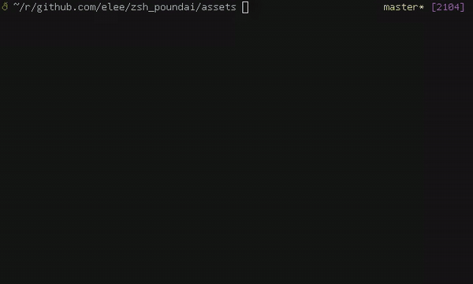

# poundai

poundai is a way to get llm-generated commands for any terminal, with your existing shell

so the idea is instead of waiting for long response from harness/pulling up web ui/copy pasting output, you can recall commands from a llm, without leaving the terminal you want to run the command.



## setup

### install

grab the latest release for your platform. this example is for linux amd64:

```sh
curl -fLO https://github.com/elee1766/poundai/releases/latest/download/poundai-linux-amd64.tar.gz
tar -xzf poundai-linux-amd64.tar.gz
install -Dm755 poundai-linux-amd64/poundai "$HOME/.local/bin/poundai"
install -Dm644 poundai-linux-amd64/poundai.plugin.zsh "${XDG_DATA_HOME:-$HOME/.local/share}/poundai/poundai.plugin.zsh"
install -Dm644 poundai-linux-amd64/poundai.plugin.bash "${XDG_DATA_HOME:-$HOME/.local/share}/poundai/poundai.plugin.bash"
install -Dm644 poundai-linux-amd64/config.example.yaml "${XDG_CONFIG_HOME:-$HOME/.config}/poundai/config.yml"
```

the archive has the binary, both shell plugins, and an example config. replace
`linux-amd64` with `linux-arm64`, `darwin-amd64`, or `darwin-arm64` if needed.

releases use utc calver tags: `YYYY.MM.DD`, then `.1`, `.2`, and so on if there
is more than one release that day. every tested push to `master` makes a release,
and you can also run the release workflow manually.

if you would rather build it yourself:

```sh
make install
mkdir -p "${XDG_CONFIG_HOME:-$HOME/.config}/poundai"
cp config.example.yaml "${XDG_CONFIG_HOME:-$HOME/.config}/poundai/config.yml"
```

then edit `config.yml` and tell poundai which provider and model to use.

### custom context

poundai can run an executable hook when `context.commands` is not enough. it
runs from your current directory on every completion, and whatever it prints is
added to the llm context:

```sh
mkdir -p "${XDG_CONFIG_HOME:-$HOME/.config}/poundai"
cat > "${XDG_CONFIG_HOME:-$HOME/.config}/poundai/context" <<'EOF'
#!/bin/sh
printf 'active project: %s\n' "${PROJECT_NAME:-unknown}"
EOF
chmod +x "${XDG_CONFIG_HOME:-$HOME/.config}/poundai/context"
```

then point at it from `config.yml`:

```yaml
context:
  hook: context
```

relative paths start from the directory containing `config.yml`. environment
variables and a leading `~` work too. poundai ignores failures and empty output,
and cuts the hook off after two seconds or 4 KiB of output. `-no-context` skips
the hook and all built-in context.

### zsh

add this to `~/.zshrc`:

```zsh
source "${XDG_DATA_HOME:-$HOME/.local/share}/poundai/poundai.plugin.zsh"
```

type `# <prompt>` and press enter. poundai keeps the comment in your history and
puts the generated command at the next prompt so you can check it before running
it.

you can also bind `create_poundai_completion` to a key and use it anywhere in a
command. this is the recommended way to use poundai:

```zsh
bindkey '^X' create_poundai_completion
```

### bash

a bash plugin exists, but i strongly recommend zsh. bash does not give us a nice
way to take over the enter key.

add this to `~/.bashrc`:

```bash
source "${XDG_DATA_HOME:-$HOME/.local/share}/poundai/poundai.plugin.bash"
```

type a partial command or `# <prompt>`, then press ctrl-x ctrl-a. poundai inserts
the result at your cursor. comment prompts put it on the next line so you can
check it before pressing enter.

if you want another binding, add it after sourcing the plugin:

```bash
bind -x '"\C-g":create_poundai_completion'
```

you can override the binary, service, or config for one shell with
`ZSH_POUNDAI_BIN`, `ZSH_POUNDAI_SERVICE`, and `ZSH_POUNDAI_CONFIG`. bash has the
same variables under `BASH_POUNDAI_*`.
